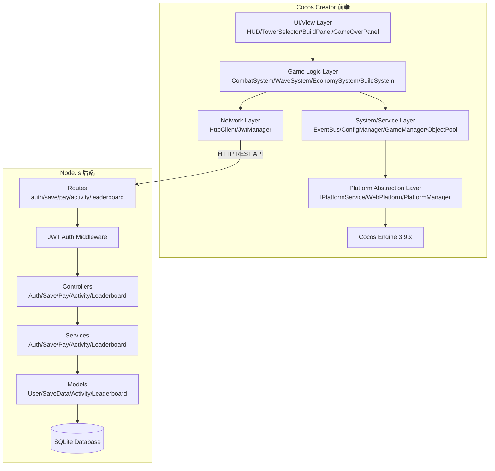

## 产品概述

构建一个支持多平台（PC Web / Android / iOS / 微信小游戏）的塔防 Demo 及其完整后端服务。前端使用 Cocos Creator 3.9.x + TypeScript 开发，后端使用 Node.js + Express + TypeScript + SQLite + JWT。核心验证目标：同一套游戏逻辑无需修改即可跨平台运行、基础战斗循环成立、数值成长曲线合理、前后端系统架构支持后续扩展。

## 核心功能

### 前端（客户端）

- **战斗系统**：塔的建造与攻击、敌人沿路径移动、子弹飞行与命中、伤害结算，全部走状态机模式
- **波次系统**：JSON 配置驱动的多波次敌人刷新，支持普通波、精英波、Boss 波
- **经济系统**：金币产出（击杀奖励）+ 金币消耗（建塔/升级），形成可持续闭环
- **Build 三选一系统**：每波结束后弹出3张 Buff 卡牌，玩家选择1张获得局内永久增益（攻击+20%、冰霜减速、弹射+1等），roguelike 策略深度
- **平台抽象层**：IPlatformService 接口统一封装登录、存储、分享等平台能力，提供 Web/Android/iOS/WeChat 四个实现
- **存档系统**：本地存档 + 云端同步（对接后端 REST API）
- **网络请求层**：封装 HTTP 客户端，统一处理 JWT Token 和错误
- **全部数值配置化**：塔属性、敌人属性、波次配置、Buff 效果全部走 JSON 配置文件

### 后端（服务端）

- **账号系统**：注册/登录，bcrypt 密码哈希 + JWT Token 鉴权
- **用户信息**：获取用户等级、金币、解锁塔等持久化数据
- **云存档同步**：JSON 格式存取游戏存档，支持上传/下载
- **支付模拟**：模拟充值金币接口（非真实支付通道）
- **活动系统**：每日签到奖励、限时任务列表
- **排行榜**：波次通关排行（全局排行）

## 技术栈

### 前端

- **游戏引擎**：Cocos Creator 3.9.x
- **开发语言**：TypeScript
- **配置格式**：JSON（tower.json / enemy.json / wave.json / buff.json）
- **目标平台**：PC Web（HTML5）/ Android / iOS / 微信小游戏
- **HTTP 客户端**：基于 fetch 的轻量封装（Cocos 兼容）

### 后端

- **运行时**：Node.js 18+
- **框架**：Express.js + TypeScript
- **数据库**：SQLite（better-sqlite3，同步 API，零配置）
- **鉴权**：jsonwebtoken（JWT）+ bcryptjs（密码哈希）
- **校验**：zod（请求体 schema 校验）

## 实现方案

### 整体架构策略

**前端**采用严格的四层分层架构：UI/View层 → GameLogic层 → System/Service层 → Platform Abstraction层。战斗系统采用纯状态机模式，每一帧输入确定性地驱动状态更新和输出。

**后端**采用经典 MVC 分层架构：Router → Controller → Service → Model。Router 负责路由分发和 JWT 鉴权中间件注入，Controller 负责请求参数校验和响应封装，Service 负责业务逻辑编排，Model 负责 SQLite 数据存取。

**前后端通信**通过 RESTful API，前端 NetworkClient 统一封装 fetch 请求，自动附加 JWT Token，后端 JWT 中间件统一校验。

### 关键技术决策

**1. 前端组件化而非继承**
Cocos Creator 3.x 使用 Component 模式，每个游戏实体（塔、敌人、子弹）都是一个挂载了对应 Component 的 Node。通过组合 Component 实现行为复用。

**2. 配置驱动的数值系统**
所有战斗数值存储在 JSON 配置文件中，通过 ConfigManager 在运行时加载。修改数值只需改 JSON。

**3. 事件总线解耦系统间通信**
单例 EventBus 在战斗、波次、经济、Build 四个子系统之间传递消息，避免系统间直接耦合。

**4. 后端 SQLite 选型理由**
Demo 阶段不需要独立的数据库服务，SQLite 零配置、零运维、数据存储在单文件中，迁移方便。better-sqlite3 提供同步 API，代码简洁无回调地狱。

**5. JWT 鉴权方案**
登录后签发 access_token（24h 有效期），前端存储于内存+localStorage，每次请求通过 Authorization: Bearer 头携带。后端中间件统一校验。

### 实现注意事项

- **性能**：前端敌人和子弹使用 Cocos 内置 NodePool 对象复用；后端 SQLite 使用 WAL 模式提升并发读取性能
- **日志**：前端使用 cc.log/cc.warn/cc.error；后端使用 console.log 输出请求日志
- **安全性**：后端密码使用 bcryptjs 加盐哈希，JWT secret 从环境变量读取，请求体使用 zod schema 校验防注入
- **兼容性**：前端所有 Cocos API 限定在 3.x 稳定 API 范围内；后端 fetch 封装需兼容 Cocos 的全局 fetch 实现

## 架构设计

### 系统架构图



### 数据流

**游戏内战斗流程（纯前端）**：

```
用户点击建塔 → TowerSelector发出事件 → EconomySystem检查金币
  → 扣除金币 → TowerManager创建塔Node → CombatSystem注册塔
  → 每帧Update → Tower寻找范围内敌人 → 创建子弹 → BulletSystem飞行
  → DamageResolver结算 → 敌人死亡 → EnemyDied事件
  → EconomySystem加金币 → WaveSystem检查波次结束
  → 触发BuildSystem弹出三选一 → 选择Buff → CombatSystem应用增益
```

**云端数据同步流程（前后端）**：

```
登录 → POST /api/auth/login → 后端签发JWT → 前端保存Token
存档 → SaveSystem序列化 → NetworkClient携带Token → POST /api/save/sync → SQLite写入
加载 → NetworkClient携带Token → GET /api/save/load → SQLite读取 → SaveSystem反序列化
排行榜 → 游戏结束 → POST /api/leaderboard/submit → SQLite写入 → GET /api/leaderboard/waves → 返回排名
```

## 目录结构

```
demo/
├── client/                                # Cocos Creator 前端项目
│   ├── assets/
│   │   ├── scripts/
│   │   │   ├── core/
│   │   │   │   ├── EventBus.ts            # [NEW] 全局事件总线，单例模式，on/emit/off
│   │   │   │   ├── ConfigManager.ts       # [NEW] 配置管理器，resources.load 加载 JSON 配置，泛型查询+缓存
│   │   │   │   ├── GameManager.ts         # [NEW] 游戏状态管理，WAITING/PLAYING/PAUSED/WAVE_COMPLETE/GAME_OVER 枚举
│   │   │   │   └── ObjectPool.ts          # [NEW] 对象池封装，基于 NodePool，get/put/clear
│   │   │   ├── combat/
│   │   │   │   ├── Tower.ts               # [NEW] 塔组件，每帧检测范围内最近敌人并发射子弹
│   │   │   │   ├── TowerManager.ts        # [NEW] 塔管理器，建造/出售/升级，塔位占用状态
│   │   │   │   ├── Enemy.ts               # [NEW] 敌人组件，沿路径点移动，血量更新，死亡事件
│   │   │   │   ├── EnemyManager.ts        # [NEW] 敌人管理器，生成/移动/死亡，到达终点扣血
│   │   │   │   ├── Bullet.ts              # [NEW] 子弹组件，向目标移动，命中触发 DamageResolver
│   │   │   │   ├── BulletSystem.ts        # [NEW] 子弹系统，对象池管理，发射/回收
│   │   │   │   └── DamageResolver.ts      # [NEW] 伤害结算器，基础攻击*(1+Buff加成)，暴击/减速
│   │   │   ├── wave/
│   │   │   │   └── WaveSystem.ts          # [NEW] 波次系统，按配置生成敌人，波间等待，发出波次事件
│   │   │   ├── economy/
│   │   │   │   └── EconomySystem.ts       # [NEW] 经济系统，earn/spend/canAfford，监听事件自动操作
│   │   │   ├── build/
│   │   │   │   ├── BuildSystem.ts         # [NEW] Build系统，随机抽3个Buff，应用永久增益
│   │   │   │   └── BuffData.ts            # [NEW] Buff数据定义，BuffEffect接口+ BuffType枚举
│   │   │   ├── network/
│   │   │   │   ├── HttpClient.ts          # [NEW] HTTP客户端，封装fetch，自动附加JWT，统一错误处理
│   │   │   │   └── ApiEndpoints.ts        # [NEW] API端点常量，定义所有后端接口URL
│   │   │   ├── platform/
│   │   │   │   ├── IPlatformService.ts    # [NEW] 平台抽象接口，login/saveData/loadData/share
│   │   │   │   ├── WebPlatform.ts         # [NEW] Web平台，localStorage存储，模拟登录
│   │   │   │   ├── WechatPlatform.ts      # [NEW] 微信小游戏平台（骨架）
│   │   │   │   ├── AndroidPlatform.ts     # [NEW] Android平台（骨架）
│   │   │   │   ├── IOSPlatform.ts         # [NEW] iOS平台（骨架）
│   │   │   │   └── PlatformManager.ts     # [NEW] 平台管理器，运行时自动选择平台实现
│   │   │   ├── save/
│   │   │   │   └── SaveSystem.ts          # [NEW] 存档系统，本地+云端双存档，serialize/deserialize/sync
│   │   │   └── ui/
│   │   │       ├── HUD.ts                 # [NEW] 顶部HUD，波次/金币/生命值
│   │   │       ├── TowerSelector.ts       # [NEW] 底部塔选择栏，3种塔类型+费用+选择逻辑
│   │   │       ├── BuildPanel.ts          # [NEW] Build三选一弹窗，3张Buff卡片
│   │   │       └── GameOverPanel.ts       # [NEW] 游戏结束面板，统计+重新开始
│   │   ├── config/
│   │   │   ├── tower.json                 # [NEW] 塔配置：id/name/attack/range/attackSpeed/cost/color
│   │   │   ├── enemy.json                 # [NEW] 敌人配置：id/name/hp/speed/gold/color/scale
│   │   │   ├── wave.json                  # [NEW] 波次配置：wave/enemyType/count/spawnInterval/restTime
│   │   │   └── buff.json                  # [NEW] Buff配置：id/name/description/type/value/weight/iconColor
│   │   ├── scenes/
│   │   │   └── GameScene.scene            # [NEW] 游戏主场景，地图/路径/塔位/UI Canvas
│   │   ├── prefabs/
│   │   │   ├── TowerArrow.prefab          # [NEW] 箭塔预制体
│   │   │   ├── TowerCannon.prefab         # [NEW] 炮塔预制体
│   │   │   ├── TowerIce.prefab            # [NEW] 冰塔预制体
│   │   │   ├── EnemyNormal.prefab         # [NEW] 普通敌人预制体
│   │   │   ├── EnemyElite.prefab          # [NEW] 精英敌人预制体
│   │   │   ├── EnemyBoss.prefab           # [NEW] Boss敌人预制体
│   │   │   └── Bullet.prefab              # [NEW] 子弹预制体
│   │   └── resources/
│   │       └── (占位几何图形资源，代码生成)
│   ├── settings/
│   ├── package.json
│   └── tsconfig.json
│
└── server/                                # Node.js 后端项目
    ├── src/
    │   ├── app.ts                         # [NEW] Express 应用入口，注册中间件和路由，监听端口3000
    │   ├── routes/
    │   │   ├── auth.routes.ts             # [NEW] 认证路由，POST register/login
    │   │   ├── user.routes.ts             # [NEW] 用户路由，GET profile
    │   │   ├── save.routes.ts             # [NEW] 存档路由，POST sync / GET load
    │   │   ├── pay.routes.ts              # [NEW] 支付路由，POST recharge
    │   │   ├── activity.routes.ts         # [NEW] 活动路由，GET daily/tasks
    │   │   └── leaderboard.routes.ts      # [NEW] 排行榜路由，POST submit / GET top
    │   ├── controllers/
    │   │   ├── auth.controller.ts         # [NEW] 注册/登录请求处理，参数校验，返回JWT
    │   │   ├── user.controller.ts         # [NEW] 用户信息查询
    │   │   ├── save.controller.ts         # [NEW] 存档同步/加载
    │   │   ├── pay.controller.ts          # [NEW] 模拟充值，增加金币
    │   │   ├── activity.controller.ts     # [NEW] 每日签到/任务列表
    │   │   └── leaderboard.controller.ts  # [NEW] 排行榜提交/查询
    │   ├── services/
    │   │   ├── auth.service.ts            # [NEW] 注册(密码哈希)/登录(验证+bcrpyt比较)/签发JWT
    │   │   ├── user.service.ts            # [NEW] 用户数据查询/更新
    │   │   ├── save.service.ts            # [NEW] 存档JSON存取
    │   │   ├── pay.service.ts             # [NEW] 模拟充值逻辑
    │   │   ├── activity.service.ts        # [NEW] 签到逻辑/任务管理
    │   │   └── leaderboard.service.ts     # [NEW] 排行榜CRUD+排序
    │   ├── models/
    │   │   ├── user.model.ts              # [NEW] 用户表 CRUD：id/username/password_hash/gold/level/created_at
    │   │   ├── save.model.ts              # [NEW] 存档表 CRUD：id/user_id/save_data/timestamp
    │   │   ├── activity.model.ts          # [NEW] 活动表 CRUD：签到记录/任务进度
    │   │   └── leaderboard.model.ts       # [NEW] 排行榜表 CRUD：id/user_id/waves_reached/score/timestamp
    │   ├── middleware/
    │   │   ├── auth.middleware.ts          # [NEW] JWT鉴权中间件，解析Authorization头，验证Token，注入req.user
    │   │   └── error.middleware.ts         # [NEW] 全局错误处理中间件，统一JSON错误响应格式
    │   ├── database/
    │   │   └── db.ts                       # [NEW] SQLite初始化，better-sqlite3连接，建表语句，WAL模式
    │   └── types/
    │       └── index.ts                    # [NEW] 全局类型定义：JwtPayload/ApiResponse/等
    ├── package.json                        # [NEW] 后端依赖：express/better-sqlite3/jsonwebtoken/bcryptjs/zod
    └── tsconfig.json                       # [NEW] TypeScript配置，target ES2020，module commonjs
```

## 关键接口定义

### 前端关键接口

```typescript
// HttpClient.ts — HTTP 请求封装
class HttpClient {
  private static instance: HttpClient;
  private token: string | null;
  private baseUrl: string;
  
  get<T>(path: string): Promise<ApiResponse<T>>;
  post<T>(path: string, body: object): Promise<ApiResponse<T>>;
  setToken(token: string): void;
  clearToken(): void;
  private request<T>(method: string, path: string, body?: object): Promise<ApiResponse<T>>;
}

// ApiResponse 泛型
interface ApiResponse<T> {
  success: boolean;
  data?: T;
  error?: string;
}

// SaveSystem.ts — 增强后的存档数据结构
interface SaveData {
  level: number;
  gold: number;
  unlockedTowers: string[];
  maxWaveReached: number;
}
```

### 后端 API 设计

| 方法 | 路径 | 鉴权 | 功能 |
| --- | --- | --- | --- |
| POST | /api/auth/register | 否 | 注册，body: {username, password} → {token, user} |
| POST | /api/auth/login | 否 | 登录，body: {username, password} → {token, user} |
| GET | /api/user/profile | 是 | 获取用户信息 → {username, gold, level, maxWave} |
| POST | /api/save/sync | 是 | 云存档同步，body: {saveData} → {timestamp} |
| GET | /api/save/load | 是 | 云存档加载 → {saveData, timestamp} |
| POST | /api/pay/recharge | 是 | 模拟充值，body: {amount} → {gold} |
| GET | /api/activity/daily | 是 | 每日签到 → {signed, reward, streak} |
| GET | /api/activity/tasks | 是 | 活动任务列表 → [{id, name, progress, reward}] |
| POST | /api/leaderboard/submit | 是 | 提交成绩，body: {waves} → {rank} |
| GET | /api/leaderboard/waves | 是 | 排行榜 top50 → [{username, waves, score}] |


### 后端数据库 Schema

```sql
-- users 表
CREATE TABLE users (
  id INTEGER PRIMARY KEY AUTOINCREMENT,
  username TEXT UNIQUE NOT NULL,
  password_hash TEXT NOT NULL,
  gold INTEGER DEFAULT 100,
  level INTEGER DEFAULT 1,
  max_wave INTEGER DEFAULT 0,
  created_at DATETIME DEFAULT CURRENT_TIMESTAMP
);

-- saves 表
CREATE TABLE saves (
  id INTEGER PRIMARY KEY AUTOINCREMENT,
  user_id INTEGER UNIQUE NOT NULL,
  save_data TEXT NOT NULL,
  updated_at DATETIME DEFAULT CURRENT_TIMESTAMP,
  FOREIGN KEY(user_id) REFERENCES users(id)
);

-- daily_signin 表
CREATE TABLE daily_signin (
  id INTEGER PRIMARY KEY AUTOINCREMENT,
  user_id INTEGER NOT NULL,
  sign_date DATE NOT NULL,
  streak INTEGER DEFAULT 1,
  reward_gold INTEGER DEFAULT 0,
  UNIQUE(user_id, sign_date),
  FOREIGN KEY(user_id) REFERENCES users(id)
);

-- leaderboard 表
CREATE TABLE leaderboard (
  id INTEGER PRIMARY KEY AUTOINCREMENT,
  user_id INTEGER UNIQUE NOT NULL,
  waves_reached INTEGER NOT NULL,
  score INTEGER NOT NULL,
  submitted_at DATETIME DEFAULT CURRENT_TIMESTAMP,
  FOREIGN KEY(user_id) REFERENCES users(id)
);
```

## 设计风格

采用扁平化几何图形风格，所有游戏元素使用纯色方块和圆形表示，摒弃复杂纹理和动画骨架。整体视觉简洁明快，适合快速开发和跨平台一致展示。地图为俯视视角塔防经典布局。

## 页面设计（单场景游戏）

### 1. 地图区域（中央主区域）

- 深绿色(#2D5A27)背景代表草地，浅棕色(#8B7355)宽条带代表敌人移动路径
- 路径从左起点蜿蜒至右终点，呈S形折线
- 路径两侧分布半透明虚线框标记的可建造塔位（约10-12个），点击高亮绿色边框
- 敌人（黄色/紫色/橙色圆形）沿路径平滑移动
- 已建塔（蓝/红/青色方块）显示在塔位上，周围显示淡色圆形范围指示器

### 2. 顶部 HUD 栏

- 深色半透明背景条(#1A1A2E, 70%透明度)横跨顶部
- 左侧：白色 "Wave 3/10"，18px 加粗
- 中间：金色(#FFD700)圆形图标 + 白色金币数字
- 右侧：红色心形图标 + 白色生命数字

### 3. 底部塔选择栏

- 深色半透明背景条，高度80px
- 水平排列3个塔选择按钮：箭塔(蓝)/炮塔(红)/冰塔(青)，各显示名称+费用
- 每个按钮圆角12px，宽120px，选中时白色发光边框
- 金币不足时按钮变灰半透明，不可点击

### 4. Build三选一弹窗

- 波次结束时全屏半透明黑色遮罩(60%)
- 居中白色圆角面板(440x320px)，标题"选择强化"
- 3张Buff卡片横向排列，180x240px，圆角16px，微阴影
- 卡片：顶部彩色圆形图标 + Buff名称(16px白色) + 效果描述(12px浅灰)
- 选中动效：卡片放大 scale(1.05) + 边框亮色发光

### 5. 游戏结束面板

- 与Build弹窗类似布局，居中面板
- 显示 "Victory!"(金色) 或 "Defeat!"(红色)
- 统计信息：击杀数、到达波次、剩余金币
- "再来一局"按钮，hover发光